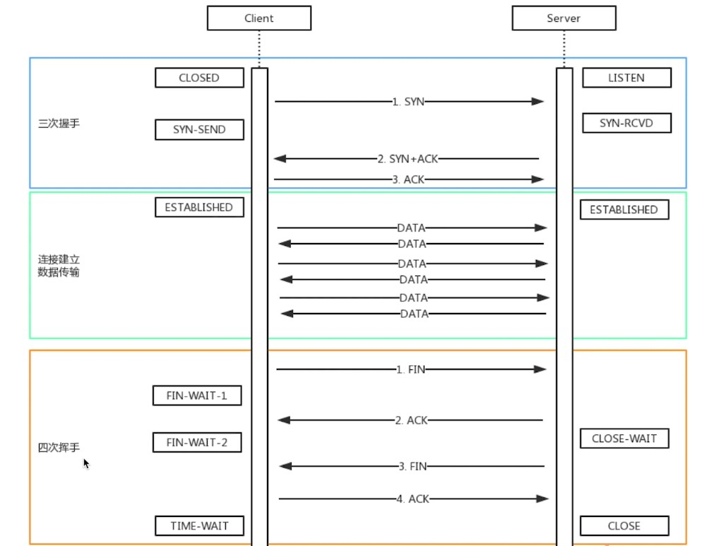
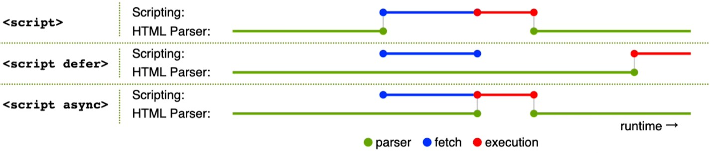

## review interview

### 基础篇

1. 说说箭头函数？
   - 缺点（或者说与 function 的不同）：
     - 没有 arguments
     - 无法通过 call、apply、bind 改变 this
       - this 固定指向父级作用域
     - 有些代码可能难以阅读
   - 什么时候不能用？
     - 需要获取函数的调用方 this 的时候
       - 例如：
         - 对象方法需要获取对象本身时
         - 自定义原型方法时
         - 构造函数
         - 事件监听
         - vue 的生命周期或 methods 等


2. 描述 TCP 的三次握手和四次挥手？
    - 如图：
    <br/>


3. 在 js 中 for-in 和 for-of 的区别？
   - for-of 可以，而 for-in 不可以的：
     - 可以遍历 Set、Map、Generator
   - for-in 可以，而 for-of 不可以的：
     - 对象
   - 总结：
     - for-in 用于 “可枚举” 数据，如：数组、字符串、对象
       - 判断可枚举：使用 Object.getOwnPropertyDescriptors 方法，看每个 key 的 enumerable 属性是否为 true
     - for-of 用于 “可迭代” 数据，如：数组、字符串、Set、Map、Generator
       - 判断可迭代：看它是否有 Symbol.iterator 属性，是否是个函数


4. 关于 for await ... of 的使用？
   - 主要是用来遍历多个 Promise 的，可以得到 Promise 的响应结果
   - 例如以下代码：
     ```js
     // 一个 promise 数组
     const plist = [p1, p2, p3]
     
     // 可以使用 promise.all
     Promise.all(plist).then((data) => {
       console.log(data) // promise 的响应结果数组
     })
     
     // 也可以使用 for await ... of 进行遍历
     for await (let res of plist) {
       console.log(res) // 得到每个 promise 响应的结果
     }
     ```


5. 关于 offsetHeight、clientHeight、scrollHeight 的区别？
    - offsetHeight：`border + padding + content`
    - clientHeight：`padding + content`
    - scrollHeight：`padding + 实际内容尺寸`
      - 在滚动时，内边距也是要参与进去的


6. 在 dom 中，Element 和 Node 的区别？
   - 首先在 Dom 树中，所有节点都是 Node
   - Node 是 Element 的基类
   - Element 是所有其它 HTML 元素的基类，如：HTMLDivElement
   - 有一张图：
     <br/>
   - 那么，HTMLCollection 和 NodeList 的区别？
     - HTMLCollection 里面都是基于 Element 类的标签，可以用 `dom.children` 获得
     - NodeList 既可以获取标签，也可以获取文本或其它节点，可以用 `dom.childNodes` 获取
     - 注意它两都是类数组结构，不是数组，无法直接使用数组的方法，可以使用以下方法转换：
       - `Array.from(NodeList)`
       - `Array.prototype.slice.call(NodeList)`
       - `[...NodeList]`


7. JS 的严格模式有什么特点？
    - 字符串 `use strict`，可以在全局开启，或者在某一个函数开启
    - 严格控制了哪些东西？（这里列举的是部分控制）
      - 全局变量必须先声明
        - 你不能在函数里面冷不丁的写一个类似 `a = 1` 的代码
      - 禁止使用 with 语法
      - 给 eval 加了作用域
      - 禁止了 this 指向 window，而是 undefined
      - 函数的参数不能重名


8. http 跨域时为何要发送 options 请求？
   - 是跨域请求之前的预检查（但也是可能会发送 options 请求，不是一定会发）
     - 可以预先拿到服务端为 CORS（跨域资源共享）配置的各种权限
       - 例如 `Access-Control-Allow-Origin` 之类的
     - 这个请求是浏览器自行发起的，不需要开发者干预，不会影响实际的功能


9. 为什么 `0.1 + 0.2 !== 0.3` ？
   - 首先这个问题不止是 js 有，其它编程语言也有，像 C、Java、Ruby .. 都有这个问题
   - 究其原因，是和计算机的底层原理有关
     - 计算机是使用二进制来存储数据的
     - 整数转换二进制没有误差
     - 有些小数无法用二进制准确表达
       - 主要是因为，二进制在表达小数时，只能够精确表示那些能够用 `1/(2^n)` 的和的任意组合表示的小数，例如：
         - 0.5 能够被二进制精确表示，是因为它可被表示成 `1/2`
         - 0.75 也能够表示，因为它可以表示成为 `1/2 + 1/(2^2)`
         - 0.875 也能够表示，因为它可以表示成为 `1/2 + 1/(2^2) + 1/(2^3)`


10. 说一说 JS 的垃圾回收机制？
    - 引用计数
      - 看对象有没有被引用，没有被引用即触发垃圾回收
      - 这种方式对于循环引用不太好使
    - 标记清除（目前的方案）
      - 定期的从 JS 的根（Window）进行下面各个属性的遍历，遍历完没能得到的对象会被回收
      - 可以解决循环引用问题
      - 关于新生代和老生代？
        - 这个问题其实不去了解也行，因为我们开发是不能控制的，知道了也用处不大
        - 这个是标记清除算法的一个优化策略：分代回收
          - 在 V8 中会把堆分为新生代和老生代两个区域
          - 新生代中存放的是生存时间短的对象，老生代中存放的生存时间久的对象
          - 垃圾回收器又分为主垃圾回收器和副垃圾回收器
          - 主垃圾回收器负责老生代的垃圾回收，副垃圾回收器负责新生代的垃圾回收


11. 如何检测 JS 内存泄漏？
    - 主要是使用 Chrome 开发工具里的 Performance 功能，看页面在运行过程中的内存变化
    - 也可以结合 Memory 功能一起看，里面保存有当前页面实时运行的各个对象及所占内存大小


12. JS 内存泄漏的场景有哪些？
    - 以现代 Vue、React 组件为例：
       - 被全局对象、变量引用，组件销毁时未清除
         - 例如把临时变量挂到 Window 上，或者挂到外部的 data 对象上
       - 定时器，组件销毁时未清除
       - 全局事件，组件销毁时未解绑
    - 了解关于 WeakSet 和 WeakMap 的运用吗？
      - 我们拿 WeakMap 为例来讲，WeakSet 同理
        - 它的 key 值必须是引用类型的，而且它是弱引用
        - 弱引用的意思就是说，假如 WeakMap 拿了某一个对象作为 key 值，按道理来说这个对象就被引用了，但是 WeakMap 并不影响这个对象的垃圾回收（该回收回收，WeakMap 管不着），所以 WeakMap 没有 size 属性，也不能遍历，反正和大小相关的方法，它都没有
        - 这个 API 可以用于给两个对象建立联系，但是并不影响它们的垃圾回收，这样也就不会有内存泄漏的风险


13. 浏览器和 nodejs 中的事件循环有什么不同？
    - 注意，在 nodejs 官文中，并没有微任务和宏任务这个说法，这里为了方便理解，在 node 中继续使用微任务和宏任务这两个名词
    - 首先，浏览器和 nodejs 的事件循环基本上是一致的，都有同步任务，微任务和宏任务，并且微任务是在宏任务之前执行的
    - 不同点在于，nodejs 中的任务分不同的类型，和不同的优先级（关于 nodejs 事件循环的具体内容，可以在我的 nodejs 深入浅出文章中了解到）
      - 微任务执行顺序：
        - `process.nextTick`
        - `Promise、await/async`
      - 宏任务执行顺序：
        - `timers` 计时器相关
        - `pending callbacks` 网络、流、TCP 相关
        - `idle, prepare` 系统内部执行
        - `poll` I/O 相关回调
        - `check` setImmediate 的回调
        - `close callbacks` close 事件相关


14. 描述一下 js-bridge 的原理？
    - 首先什么是 js-bridge？
      - 是 js 与 APP或客户端之间通信的桥梁
      - js 是无法直接调用 native API 的，需要通过一些特定的方式来调用，这些方式就统称为 js-bridge，例如：微信 JSSDK
    - js-bridge 的原理就是 APP 往 webview 里面灌输很多自定义的 API，主要分为两种方式：
      - 注册全局 API
        - 例如直接在 window 上挂载一个方法，当 js 调用该方法时，由 APP 控制方法的执行
        - 这种方式不太适合异步的情况
      - URL Scheme
        - 例如微信的 URL Scheme：
          - `weixin://` 打开微信
          - `weixin://dl/scan` 扫一扫
          - `weixin://dl/moments` 朋友圈
        - js 可以通过 `location.href` 的方式来调用 URL Scheme，在 APP 端会做 URL 的拦截
          - 这种方式会改变页面的 url，如果 URL Scheme 没有被处理，可能会导致网页跳转到一个错误页面
        - js 也可以通过 `iframe` 的方式封装方法，通过 iframe.src 调用 URL Scheme
          - 这样就避免了直接修改 location.href，当然这只是前端调用方式的一种选择，在 APP 端还是要做 URL 拦截处理的
    - 顺带一提，Chrome 本身也是 APP，可以浏览网页也是因为有 webview，只不过它是以 webview 为主体的 AP
      - 它也实现了很多的 URL Scheme 功能，例如：
        - `chrome://version/`
        - `chrome://flags/`
        - `chrome://dino/`
        - `chrome://inspect/#devices`


15. requestAnimationFrame 和 requestIdleCallback 有什么区别？
    - RAF 在每次渲染完都会尝试执行，也就是在当前帧内一定会尝试执行，高优先级
      - 如果当前帧没有空闲时间了，则会推迟到下一帧执行，如果还没有，就继续推迟，反正最终一定会执行，且每一帧最多只会执行一次
    - requestIdleCallback 空闲时执行，低优先级
      - 如果一直没有时间执行，可以设置一个超时时间，这样在到了超时时间后，会强制执行
    - 这两个任务都可以理解成宏任务
      - 并且会在无延迟时间的 setTimeout 之后执行


16. 移动端点击 300ms 延迟怎么解决？
    - 首先为什么会有 300ms 延迟？
        - 是移动端设计用来支持双击操作的（例如双击放大），300ms 内点击了第二次，触发双击事件，超过 300ms 未点击，触发单击事件
    - 怎么解决延迟问题？
        - 使用 fastclick 库
            - 它会监听 touchend 事件（此事件会先于 click 事件触发）
            - 使用自定义 dom 事件模拟 click 事件
            - 把默认的 click 事件（300ms 之后触发）禁止掉
        - 对于现代浏览器，只需要加一句 meta 信息即可，主要是 `width=device-width` 这一句起作用
            - `<meta name="viewport" content="width=device-width, initial-scale=1.0">`
            - 浏览器会认为，已经做了响应式，在移动端就没必要双击放大了，已经是合适的页面展示效果了


17. Retina 屏幕的 1px 如何实现？
    - 下面以 DPR = 2（1px 会用两个物理像素表示）的屏幕为例：
        - 使用 transform 缩放：`transform: scaleY(0.5)`
        - 使用阴影扩散：`box-shadow: 0 0 0 0.5px #e8e8e8`
            - X 偏移量 0
            - Y 偏移量 0
            - 阴影模糊半径 0
            - 阴影扩散半径 0.5px
            - 阴影颜色


18. https 协议为什么是安全的？它的加密过程是什么？
    - 为什么是安全的？
      - 通过在 http 协议上添加 SSL/TLS（Secure Sockets Layer/Transport Layer Security）加密层来确保数据传输的安全性
      - 通过 “非对称加密” 结合 “对称加密” 的方式来实现数据的安全通信
        - 非对称加密（服务器生成）用于给对称密钥加密，以便安全传输
        - 对称密钥（客户端生成）用于后续的数据通信，保证了速度
    - 具体的加密过程？
      - 握手过程：
        - 客户端向服务器发起连接请求
        - 服务器返回其公钥（非对称加密的公钥）和证书给客户端
      - 证书验证：
        - 客户端验证服务器的证书，确保其合法性和可信任性
      - 生成对称密钥：
        - 客户端生成一个随机的对称密钥（对称加密），用于后续的数据加密和解密
      - 数据加密：
        - 客户端使用服务器的公钥加密生成的对称密钥，并将其发送给服务器
        - 服务器使用自己的私钥解密客户端发送的对称密钥
      - 安全通信：
        - 此时，客户端和服务器现在都拥有了相同的对称密钥，他们使用这个对称密钥来加密和解密数据，从而保证通信的安全性和隐私性
        - 至于为什么最后要用对称加密通信？
          - 因为公钥加密是非常耗时的，对称加密算法比公钥加密算法更快，适合大量数据的加密和解密操作
    - 加密算法有哪些？
      - 可使用的加密库：crypto
      - 非对称加密：RSA、DSA、ECC、ECDSA、ElGamal
      - 对称加密：AES、DES、3DES、Blowfish、Twofish
    - 非对称和对称的区别？
      - 非对称加密：公钥用于加密，私钥用于解密，安全性高，适用于密钥交换和加密少量数据
      - 对称加密：同一个密钥用于加密和解密，速度快，但安全性依赖于密钥的安全管理
    - 如下图，https 加密和解密过程
      <br/>


19. https 如何防止中间人攻击？
    - 我们知道 https 是加密传输的，但是黑客还是可以攻击
      - 在服务端向客户端传输公钥的过程中，黑客把公钥给换了，换成自己的公钥和私钥
      - 然后在客户端向服务器传递数据过程中，黑客用自己的私钥解密，就能拿到加密数据
    - 解决这一问题的关键就在于：证书的合法性
      - 我们使用的证书，都是第三方的，所以最好使用那种大厂的、官方的、和浏览器公司有合作的正规的证书
      - 如果是杂七杂八的证书，浏览器可能会验证不合法，就会提示警告
        - 首先，黑客的话，一般无法模拟证书，如果修改了内容，那浏览器就会验证不合法
        - 其次，如果你的服务器本身就使用的这种杂七杂八的证书，浏览器也有可能验证不通过
      - 所以对于我们开发来说，解决这一问题主要关注的点在于，如何取得官方的正规的证书
      - 中间人攻击示意图
        <br/>
      - 浏览器警告页面
        <br/>


20. 在 http 请求中 cookie 和 token 的区别？
    - 首先 cookie 和 session 是一对，大致流程如下：
      - 用户在浏览器登录，输入用户名和密码
      - 服务端登录校验，保存用户信息到 session 中，并将用户的唯一标识放到 cookie 中，并返回给浏览器
      - 以后，该用户在发送请求时，会带上这个 cookie 去服务器
      - 服务器根据 cookie 中的用户标识，获取用户信息
    - token 一般是用于 JWT（JSON Web Token）实现
      - 用户在浏览器登录，输入用户名和密码
      - 服务端登录校验，将用户信息整个加密成 token 并返回给浏览器
      - 以后，该用户在发送请求时，会带上这个 token 去服务器
      - 服务器直接解密 token 拿取用户信息
    - token 和 cookie 的区别总结？
      - cookie 是 http 规范，token 是自定义传递（一般是加一个 Authorization 请求头传递 token 数据）
      - cookie 默认被浏览器存储，token 需自己存储（一般会使用 localStorage）
      - cookie 有跨域限制，而 token 没有
      - cookie 设计出来就是为了解决登录验证问题，但是它有很多不好用的地方，所以人们自己发明了 token 这种方式
    - session 和 JWT 的优缺点？
      - session
        - 优点
          - 用户信息存储在服务端，可快速封禁某用户
        - 缺点
          - 占用服务端内存，硬件成本高
          - 多进程，多服务器时，不好同步，需要使用第三方缓存，如 redis
          - 跨域限制，系统复杂时，处理比较麻烦
        - 适合场景
          - 需要严格的管理用户的信息（保密、快速封禁）
      - JWT
        - 优点
          - 不占用服务器内存
          - 多进程，多服务器时，不受影响
          - 无跨域限制
        - 缺点
          - 用户信息存储在客户端，无法快速封禁某用户
          - 安全问题，万一服务端密钥泄漏，则用户信息全部丢失
          - 因为所有信息都在 token 中，请求数据量会增大
            - 这个其实影响不大，因为现代的硬件和网速条件都够好，数据大个一两 KB 也无伤大雅
        - 适合场景
          - 没有特殊要求（如创业初期的网站），可以节约很多成本


21. 如何实现 SSO（单点登录）？
    - 单点登录：只需要登录一次，就可以在相互信任的多个应用系统中共享登录状态
      - 例如：登录了淘宝，就可以使用天猫，登录了百度，就可以逛百度贴吧
      - 单点登录和联合登录的区别？
        - 单点登录注重在同一组织内使用、统一管理
        - 联登注重跨组织、跨域的身份验证和信任关系
    - SSO 实现方案？
      - 主域名相同，则可以使用共享 cookie 的方案
      - 主域名不同，使用第三方的 SSO 认证系统
        - 如图所示（最后访问系统 B 的时候，线画错了，问题不大）：
          - 下图中的 SSO 凭证就是 ticket，或者叫 token 也行，最终在 A、B、SSO 域名下都会存储
          - 客户端 A、B 的 token 可能是一样的，但是必须在 A、B 上分别存储，因为一般使用 localStorage 存储，这个并不跨域共享
          - 登录页面是 SSO 系统的，在 B 页面去 SSO 系统带的 token，是从 SSO 域名下拿到的，也就是说，会先去 SSO 的前端页面
          <br/>
        - 使用第三方账号登录，遵循 OAuth 2.0 规范（OAuth 也是实现单点登录的常见技术方案）
          - 例如用户访问客户端，服务器判定需要登录，网站授权使用微信登录
          - 微信可能提供给客户端一个二维码，用户扫描二维码登录，返回一个 token 在客户端保存
          - 用户继续发送请求时，会带上这个 token 去服务器
          - 服务器拿这个 token 去微信做校验，校验成功则继续业务


22. HTTP 与 UDP 协议的区别？
    - 首先，HTTP 与 UDP 不是一个网络层级的
      - HTTP 是基于 TCP 的，TCP 和 UDP 是属于同一层级的
      - HTTP 是应用层，TCP 和 UDP 是传输层
    - TCP 有连接，有断开，稳定传输，一般用于网络请求
    - UDP 无连接，无断开，不稳定传输（效率高），一般用于视频会议、语音通话
      <br/>


23. HTTP 的 1.0、1.1、2.0 有什么区别？
    - http 1.0
      - 最基础的，支持基本的 get、post 请求方法
    - http 1.1
      - 增加缓存策略：cache-control、E-tag
      - 支持长连接：Connection: keep-alive，一次 TCP 连接，可以发送多个请求
      - 支持断点续传，状态码 206
      - 支持新的请求方法：PUT、Delete .. ，可用于 Restful API
    - http 2.0
      - 可压缩请求头，减少体积（请求头一般还是有点大的，例如 cookie、token 数据都在请求头内）
      - 多路复用，一次 TCP 连接，可以多个 http 并发请求
        - 有了这个特性，之前做的有些优化就没用了
        - 例如：合并三个文件为一个文件，只用发送一次请求，来优化性能
        - 但是 http 2.0 即使面对三个文件，它也能并发请求，不会影响效率
      - 服务端推送
        - 服务端在客户端需要数据之前就主动地将数据发送到客户端缓存中，从而提高性能
        - 主要应用于 websocket 技术


24. script 标签的 defer、async 有什么区别？
    - 如图所示：
      - 什么都不写，只要遇到 script，就中断 dom 渲染，js 加载后执行
      - 使用 async 时，加载时异步，但是加载完立即执行，中断 dom 渲染
      - 使用 defer 时，加载时异步，加载完后，等待 dom 渲染完成，然后执行
      <br/>
      - 使用 defer 是一种比较理想的方式
        - 我们之前写的：把 script 写到 body 的末尾，会在最后才加载，加载完执行
        - 使用了 defer 可以并行加载，然后等待 dom 渲染完，在最后直接执行，提升了性能


25. prefetch 和 dns-prefetch 的区别？
    - 首先，这个问题是混乱的，这两个没有可比性，可以拆分为下面两个问题：
    - preload 和 prefetch 的区别？
      - preload：预加载，资源在当前页面使用，会优先加载
      - prefetch：预获取，资源在未来页面使用，空闲时加载
    - dns-prefetch 和 preconnect 的区别？
      - dns-prefetch：DNS 预查询，针对未来页面
      - preconnect：DNS 预连接，也是针对未来页面
    - 以下为代码示例：
      ```js
        <link rel="preload" href="style.css" as="style">
        <link rel="prefetch" href="other.js" as="script">
        <link rel="stylesheet" href="style.css">
        <link rel="dns-prefetch" href="https://www.baidu.com">
        <link rel="preconnect" href="https://www.baidu.com" crossOrigin>
      ```


26. 前端的攻击方式？
    - XSS：跨站脚本攻击
      - 原理：将 js 代码插入到网页内容中，渲染时执行 js 代码
      - 预防：特殊字符替换（前端和后端都要做好自己的这一块，不要指望哪一端，出了问题前端和后端都得背锅）
      - 在 Vue、React 中不需要关注这个问题，除非：Vue 使用 v-html，React 使用 dangerouslySetInnerHtml
    - CSRF：跨站请求伪造
      - 原理：诱导用户去访问另一个网站的接口，伪造请求
        - 用户登录了 A 网站，有了 cookie
        - 黑客诱导用户到 B 网站，并发起 A 网站的请求
        - A 网站的 API 发现有 cookie，认为是用户自己操作的
      - 预防：严格的跨域限制 + 验证码机制
        - 判断 referrer（请求来源，但这个也可以伪造）
        - 为 cookie 设置 SameSite，禁止跨域传递 cookie
        - 关键接口可以使用短信验证码
    - Click Jacking：点击劫持
      - 原理：在诱导界面上蒙上一层透明的 iframe，诱导用户点击，实际点击的是 iframe 上的内容（例如诱导骗关注）
      - 预防：让 iframe 不能跨域加载
        - 判断 iframe 的域名和当前域名是否一致
          ```js
            if (top.location.hostname !== self.location.hostname) {
              alert('您正在访问不安全的页面，即将跳转到安全页面！')
              top.location.href = self.location.href
            }
          ```
        - 请求头添加：`X-Frame-Options: sameorigin`
          - 只能被同域名的网页加载成 iframe，第三方网页不能把我当成 iframe 加载
    - DDoS：分布式拒绝服务（后端的）
      - 原理：分布式的、大规模的流量访问，使服务器瘫痪
        - 一般是种植病毒、木马到不知情的用户设备上，然后在统一的时间控制病毒访问
      - 软件层不好做，需要硬件防护（如：阿里云 WAF）
    - SQL 注入（后端的，经典的安全问题）
      - 原理：黑客提交内容时，写入 SQL 语句，破坏数据库
      - 预防：和 XSS 类似，处理输入内容，替换特殊字符


27. WebSocket 协议和 HTTP 协议的区别？
    - WebSocket
      - 端对端通讯，client 和 server 都可以主动发消息（一开始 client 必须先和 server 建立连接）
        - 协议是以 `ws://` 开头，无跨域限制
        - 另外，ws 可升级为 wss（类似 https，加密传输）
        - 实际开发中，建议使用 socket.io 这个库，API 使用比较简洁
          - 现代浏览器自带 WebSocket 类，测试场景可以使用下
      - 使用场景？
        - 消息通知、直播间讨论区、聊天室、协同编辑
      - 连接过程？
        - 先发起 http 请求
        - 成功后再升级到 websocket 协议通讯（可以看下 ws 请求，会有个 101 切换协议的状态码）
    - 所以 ws 和 http 的区别？
      - ws 是双端通讯，http 是单端发送请求
      - ws 无跨域限制，http 有跨域限制
      - 其它的就是写法上的不同了，例如：协议名称、消息发送与接收
        - ws：`ws://` + `send/onmessage`
        - http：`http://` + `req/res`
    - 长轮询和 websocket 的区别？
      - 长轮询
        - 客户端发送 http 请求，服务端阻塞，不会立即返回，客户端等待响应
        - 服务端有结果了再返回，返回后，客户端立即再发送请求，循环往复
        - 需要处理 timeout 机制，timeout 中断后，客户端继续补发请求
      - websocket
        - 客户端发送请求无需等待服务器响应
        - 服务器有结果了，它会主动发给客户端


28. 输入 url 到网页显示的整个过程？
    - 总的来说分为三个大的步骤：
      - 网络请求：加载资源
        - DNS 查询（得到 IP 地址），建立 TCP 连接（三次握手）
        - 浏览器发起 http 请求，得到 html 源代码
          - 解析 html 过程中，遇到静态资源，还会继续发送网络请求（js、css、图片、视频）
          - 注意：静态资源可能有缓存，此时不触发请求
      - 解析：字符串 => 结构化数据（这个过程，也是整个编程学的核心，结构化才能让使用更简单）
        - html 构建 Dom 树
        - css 构建 CSSOM 树（css object model）
        - 两树结合，生成 render tree
      - 渲染：绘制页面
        - 计算各个 dom 节点的尺寸、位置，最后绘制到页面
          - 遇到 js/css 会加载，可能会执行，中断渲染，而后恢复
            - 具体要参考加载资源的方式，是否有 defer、async 之类的
          - 异步 css、图片加载，可能会触发重新渲染
    - 如何优化解析步骤？
      - css 放在 `<head>` 中，不要异步加载 css
      - js 放在 body 最下面，或合理使用 defer、async
      - `` 提前定义 width、height
    - 解析步骤如图：
      <br/>


29. 重绘 repaint 和重排 reflow 的区别？
    - 重绘
      - 只是元素外观改变，如：颜色、背景色、阴影
      - 尺寸、位置不变，不会影响其它元素的位置
    - 重排
      - 重新计算尺寸和布局，可能会影响其它元素的位置，如：元素宽高改变、增加元素、删除元素、动画
      - 重排一定伴随着重绘，性能消耗较大
      - 减少重排的方法？
        - 集中修改样式，或直接切换 class
        - 修改样式之前先 `display: none`，脱离文档流，就不会触发渲染
        - 适当的使用 BFC 的特性，不影响外部元素的位置
        - 频繁的触发，如：resize、scroll，使用防抖、节流
        - 使用 createDocumentFragment 批量操作 dom
        - 优化动画，使用 CSS3（例如 transform）和 RAF

### Node 篇

1. 在 nodejs 中，如何开启多进程？
   - 主要有两种方式：
     - `child_process`，代码示例：[使用child_process开启多进程](./nodejs/开启多进程/使用child_process实现/index.js)
       - 子进程，适合处理一些复杂的运算场景
     - `cluster`，代码示例：[使用cluster开启多进程](./nodejs/开启多进程/使用cluster实现/index.js)
       - 集群，适合要开启多个服务的场景

### Vue 篇

1. watch 和 computed 的区别？
   - watch 用于监听现有的数据，一般不产生新数据
   - computed 用于计算产生新的数据，有缓存，methods 无缓存
   - 事实上，这两个东西并没有什么可比性


2. Vue 的组件通讯方式？
   - `props` 和 `$emit`，常规用法，父子间通讯
   - `CustomEvent`，自定义事件，适合跨多级通讯
   - `$attrs`，子组件中没有用 props 和 emits 接收的属性和方法，就会出现在 `$attrs` 上
     - 在组件中，也可以使用 `v-bind="$attrs"` 将属性和方法传递给下一级组件
     - 适用于父子通讯，作为 `props` 和 `$emit` 的替补
     - 注意 props 和 emits 属性是 Vue3 新加的
   - `$parent` 和 `$refs`，父子间通讯
     - `$parent`，子组件获取父组件的属性和方法
     - `$refs`，父组件获取子组件的属性和方法
   - `provide` 和 `inject`，上层组件 provide 数据，下层所有子组件都可以 inject 获取数据
     - 适用于父组件向下层各级子孙组件传递数据
   - `Vuex`，全局数据共享


3. Vuex 中的 mutation 和 action 的区别？
   - `mutation`：原子操作，必须写同步代码
   - `action`：可包含多个 mutation，可包含异步代码


4. Vue-router 的 MemoryHistory 是什么？
   - 其实就是在同一个 url 下，用切换不同的组件的方式，模拟切换不同的页面的效果
   - 切换路由时，不会伴随着 url 的变化
     - 这和 history、hash 完全不同，history 会伴随 pathname 的变化，hash 会伴随 hash 部分的变化
   - 在 react 中也有类似的功能

### 框架篇

1. 使用虚拟 Dom 和 JS 哪个操作 dom 更快？
   - 答案：JS 直接操作 dom 更快
   - 那为什么流行框架 Vue、React 还要用虚拟 Dom 呢？
     - 首先我们要知道一个事，Vue 和 React 之所以能火，并不是因为它们可以组件化
     - 而是因为：数据驱动视图（这让我们不需要手动操作 dom 了，由框架来做，所以在 dom 操作的性能上，是框架最需要关注的一件事）
     - 但是 Vue、React 操作 dom，也不能一次性整个 dom 都更新，它需要进行比较，也就是我们常说的 diff 算法
     - 而为了使用这个 diff 算法，vdom 就是目前最合适的技术方案
       - 注：vdom - 用 js 对象模拟 dom 节点数据
     - 所以，之所以用 vdom，并不是因为它快，而是因为它合适


2. Vue2、Vue3、React 的 diff 算法有什么不同？
   - React：节点仅右移
   - Vue2：双端比较
     - 四个指针：oldStart、newStart、oldEnd、newEnd
     - 四个比较：
       - 老头 和 新头
       - 老尾 和 新尾
       - 老头 和 新尾
       - 老尾 和 新头
     - 然后新老头指针往右移，新老尾指针往左移，继续进行比较
     - 直到头尾指针相遇，比较结束
     - 这种比较方式，尤其适合那种在中间插入节点的情况，头尾都不用动，只用在中间增加即可
       - 如果只从一端逐步往后做比较，则会徒增很多额外的增加或删除节点的操作
   - Vue3：最长递增子序列
     - 找出新节点中的最长递增子序列（使用老节点的索引找递增），保持不动
     - 只操作那些零散存在的节点，以最大化的减少操作次数


3. Vue、React 为何在循环时必须使用 key ？
   - 主要还是为 diff 算法的性能考虑
     - diff 算法会根据 key 判断元素是否要删除
     - 匹配了 key，只移动元素，性能较好
     - 未匹配 key，则删除重建，性能较差
   - 也就是说，如果没有 key，则会徒增额外的增加或删除节点的操作
   - 还有个问题就是：
     - 如果有需要自己操作 dom 的情况，如果没有 key，那节点每次都会删除重建，那每次重新渲染，这个 dom 都需要重新获取


